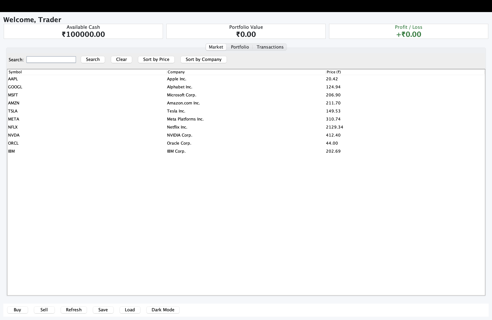
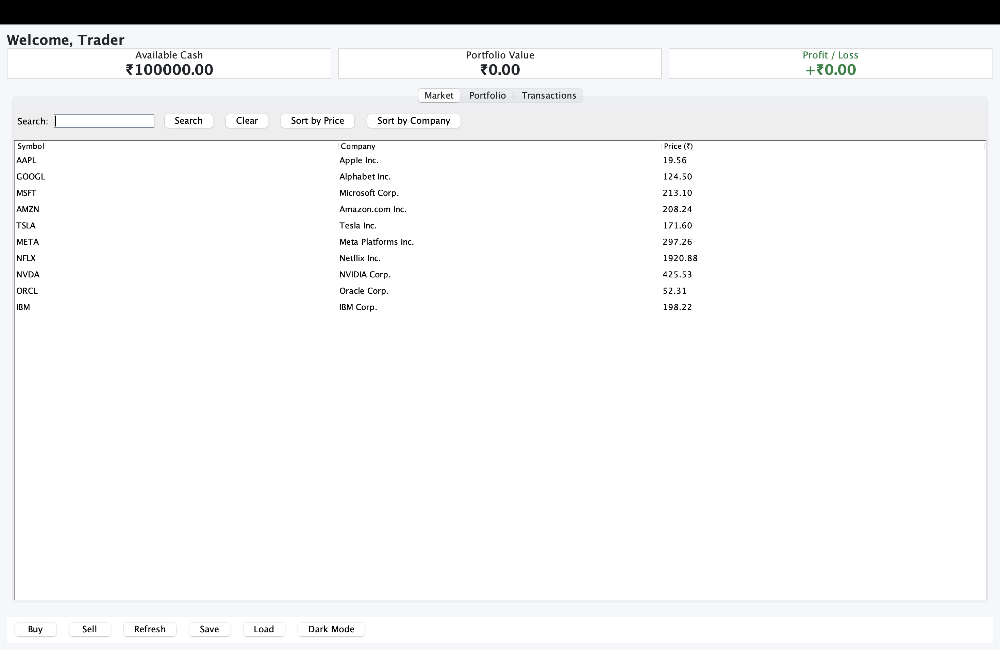
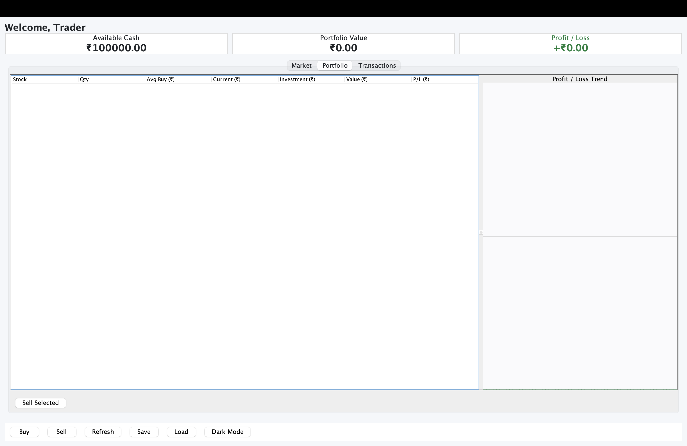
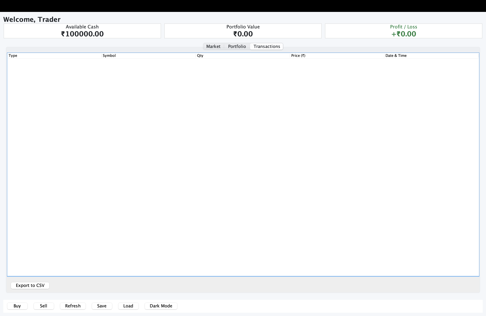

# Stock Trading Platform

A desktop Stock Trading Platform built with **Java (JDK 17+)** and **Swing**. It demonstrates core Object-Oriented Programming principles (Encapsulation, Inheritance, Polymorphism, Abstraction), a clean separation between business logic and the user interface, and persistent file storage.

## Project Description

The Stock Trading Platform lets a user simulate buying and selling shares on a live, randomly fluctuating market. The user starts with ₹100,000 in cash and can build a portfolio, watch its value change in real time, review a full transaction history, and export that history to CSV. All state is saved to disk between sessions.

## Features

- **Dashboard** – welcome message, available cash, current portfolio value, and overall profit/loss.
- **Stock Market** – 10 pre-loaded stocks (AAPL, GOOGL, MSFT, AMZN, TSLA, META, NFLX, NVDA, ORCL, IBM) with symbol, company name, and live price.
- **Buy Stocks** – pick a stock, enter a quantity; balance decreases and portfolio updates.
- **Sell Stocks** – pick an owned holding, enter a quantity; balance increases and portfolio updates.
- **Portfolio** – per-holding table showing quantity, average buy price, current price, investment, current value, and profit/loss.
- **Transactions** – full history of every BUY and SELL with date/time, price, and quantity, shown in a table.
- **Market Simulation** – prices update randomly every 3 seconds; portfolio value follows automatically.
- **Initial Balance** – every new user starts with ₹100,000.
- **Validation** – prevents buying with insufficient balance, selling more than owned, and negative quantities.
- **File Storage** – `users.dat`, `portfolio.dat`, and `transactions.dat` are written on save and read on startup.
- **GUI** – modern Swing interface using `JTable`, `JButton`, `JPanel`, `JTabbedPane`, `JScrollPane`, and tabs for Market, Portfolio, and Transactions.
- **Reports** – total investment, current portfolio value, overall profit/loss, and available cash.
- **Console Output** – every trade prints to the console, e.g. `Bought 5 shares of AAPL @ ₹220.50`.

### Bonus Features

- **Search** stocks by symbol or company name.
- **Sort** the market table by price or by company name.
- **Dark Mode** toggle for the whole window.
- **Profit/Loss Graph** – a live line chart on the Portfolio tab.
- **Export Transactions to CSV**.

## Folder Structure

```
Stock Trading Platform/
│
├── src/
│   ├── model/
│   │     User.java
│   │     Stock.java
│   │     Holding.java
│   │     Portfolio.java
│   │     Transaction.java
│   │
│   ├── service/
│   │     StockMarket.java
│   │     TradingService.java
│   │
│   ├── ui/
│   │     Main.java
│   │     Dashboard.java
│   │
│   └── util/
│         DataManager.java
│
├── README.md
└── .env (ignored – not used by this project)
```

### Package Responsibilities

| Package   | Responsibility                                                        |
|-----------|-----------------------------------------------------------------------|
| `model`   | Plain data classes: `User`, `Stock`, `Holding`, `Portfolio`, `Transaction`. |
| `service` | Business logic: `StockMarket` (simulation + queries), `TradingService` (buy/sell rules, validation, history). |
| `ui`      | Swing GUI: `Main` (entry point), `Dashboard` (window, tabs, toolbar). |
| `util`    | `DataManager` – serialization to `.dat` files and CSV export.         |

## How to Run

### Prerequisites

- Java Development Kit **17 or above**.

### From the command line

1. Open a terminal in the project root (the folder that contains `src`).
2. Compile every source file:

   ```bash
   javac -d out $(find src -name "*.java")
   ```

   On Windows PowerShell:

   ```powershell
   javac -d out src/model/*.java src/service/*.java src/util/*.java src/ui/*.java
   ```

3. Launch the application:

   ```bash
   java -cp out ui.Main
   ```

### In an IDE (VS Code or IntelliJ IDEA)

1. Open the project folder.
2. Make sure the JDK is set to 17 or higher.
3. Run `src/ui/Main.java` (it contains the `main` method).

The data files (`users.dat`, `portfolio.dat`, `transactions.dat`) are created in the working directory the first time you click **Save** or close the window.

## Sample Screenshots

> Placeholders – add your own captures here.






## Future Enhancements

- Multiple user accounts with a login screen.
- Real-time market data from a live API (e.g. Alpha Vantage, Finnhub).
- Limit and stop-loss orders.
- Dividend and split simulation.
- Sector grouping and sector-level analytics.
- Candlestick charts and technical indicators (RSI, MACD, moving averages).
- Watchlist separate from the portfolio.
- Tax / capital-gains summary report.
- Cloud sync of saved state.
